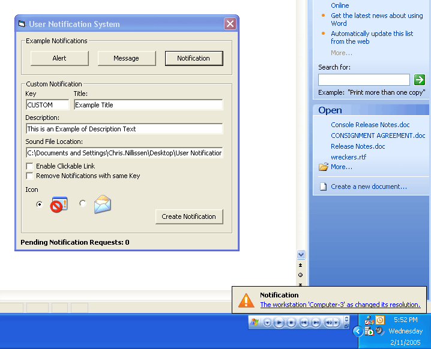



## FireFox Style User Notification Popup

### Description

FireFox Style User Notification Popup.

The User Notification Popup System is a visual feature to signal the user of any items of importance. These items may include such things as New Mail Messages, Application Alerts, Completion Notifications, etc.

As shown in the screenshot below, the test application allows you to trigger various types of Notifications. Pressing any of the example buttons will launch a popup notification instantly. Pressing another will queue up a request while the first is being displayed.

By clicking the &#8216;Alert&#8217; Button while an Alert Popup is being displayed, rather then queuing up another Alert Popup, it will update the current displayed one. Similarly, clicking the &#8216;Message&#8217; Button more then once, while the Alert Popup is being displayed, will only register one request in the queue, and when it comes time to display the Message Popup will display the last requested copy. The &#8216;Notification&#8217; Popup on the other hand, is set to queue every instance as this message has more specific details.

Feature Overview:

* Display of Title and Description text,

* Dynamic Auto-sizing to fit content,

* Feature specific icon support,

* Optional playing of a sound file on popup,

* FIFO Queuing of Popup Requests,

* Batching Popup Requests (Removal of duplicates requests),

* Optional click description to trigger event,
 
### More Info
 

             |
---                |---
**Submitted On**   |2005-11-01 11:31:00
**By**             |[Christiaan Nillissen](https://github.com/Planet-Source-Code/PSCIndex/blob/master/ByAuthor/christiaan-nillissen.md)
**Level**          |Intermediate
**User Rating**    |5.0 (25 globes from 5 users)
**Compatibility**  |VB 5\.0, VB 6\.0
**Category**       |[Custom Controls/ Forms/  Menus](https://github.com/Planet-Source-Code/PSCIndex/blob/master/ByCategory/custom-controls-forms-menus__1-4.md)
**World**          |[Visual Basic](https://github.com/Planet-Source-Code/PSCIndex/blob/master/ByWorld/visual-basic.md)
**Archive File**   |[User\_Notif1945091122005\.zip](https://github.com/Planet-Source-Code/christiaan-nillissen-firefox-style-user-notification-popup__1-63107/archive/master.zip)

